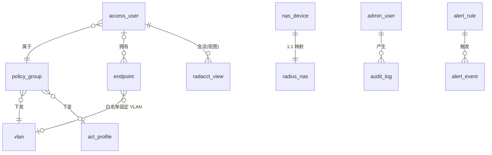
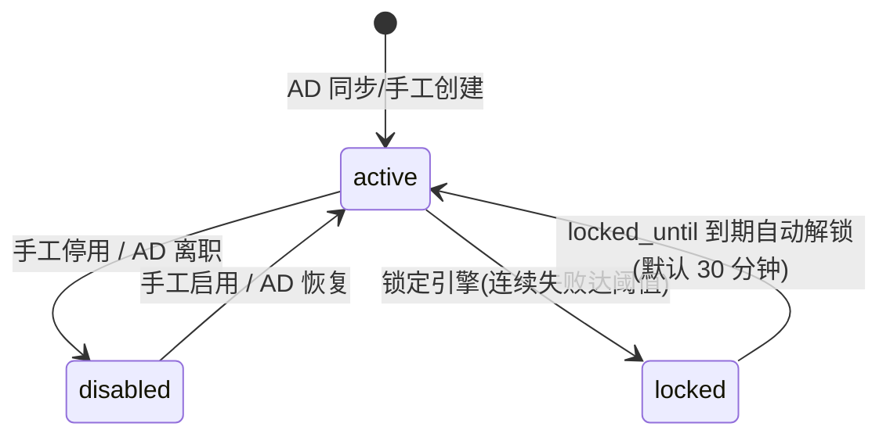

# 02 · 领域模型

## 实体总览

应用表位于 PostgreSQL `public` schema(Alembic 管理);FreeRADIUS 表位于 `radius` schema
(官方 schema.sql 初始化,**禁止** Alembic 改动其结构,只允许读写数据)。

### public schema(应用自有)

| 实体 | 关键字段 | 说明 |
|---|---|---|
| `admin_user` | id, username, display_name, password_hash, role(admin/operator/auditor), status, last_login_at | 控制台登录账户 |
| `access_user` | id, account(=sAMAccountName), name, dept, title, status(active/disabled/locked), locked_until, policy_group_id, ad_dn, ad_synced_at, source(ad/local) | 准入账号;account 唯一 |
| `policy_group` | id, name, slug, description, scope_dept, eap_method(eap-tls/peap-mschapv2), vlan_id, acl_name, session_timeout_s, reauth_interval_s, require_cert, require_mac_bind, require_edr, time_window_enabled, time_from, time_to, rate_limit_mbps, priority, enabled | 策略组=授权单元 |
| `vlan` | id, vid, name | VLAN 字典(10 办公/20 研发/30 访客/40 财务隔离/50 供应链/99 运维) |
| `acl_profile` | id, name(acl_staff…), description | ACL 字典 |
| `nas_device` | id, name(shortname), nasname(IP), type(switch/ac/ap), area, secret_enc, capacity, baseline_enabled, notes, radius_nas_id(→radius.nas.id) | NAS 管理视图 |
| `endpoint` | id, mac(唯一,大写规范), fingerprint, owner_user_id, etype(笔记本/手机/打印机/摄像头/其他), compliance(ok/warn/bad/white), comp_detail, cert_serial, cert_not_after, first_seen_at, whitelisted | 终端准入清单 |
| `ad_sync_job` | id, triggered_by(manual/cron), started_at, finished_at, status(running/success/failed), added, updated, disabled, error | 同步记录 |
| `alert_rule` | id, key(nas_offline/ap_high_load/cert_expiring/account_locked/…), enabled, threshold_json | 告警规则(设置页开关) |
| `alert_event` | id, rule_key, level(critical/warning/info), title, message, link, created_at, read_at | 告警事件(仪表盘告警流) |
| `audit_log` | id, actor, action, target_type, target_id, detail_json, ip, created_at | 审计(见 08) |
| `system_setting` | key(主键), value_json, updated_at, updated_by | 键值设置(RADIUS 端口、告警总开关等) |

### radius schema(FreeRADIUS 官方表,只节选本项目用到的列语义)

| 表 | 用途 | 本项目读写方 |
|---|---|---|
| `radcheck` | 用户检查属性(Cleartext-Password / NT-Password / Auth-Type:=Reject / Expiration) | 策略编译器写;FreeRADIUS 读 |
| `radreply` | 用户回复属性(个别覆盖) | 编译器写 |
| `radgroupcheck` | 组检查属性(如 EAP 方法约束) | 编译器写 |
| `radgroupreply` | 组回复属性(Tunnel-Private-Group-Id / Filter-Id / Session-Timeout / WISPr 限速) | 编译器写 |
| `radusergroup` | 用户→组(priority 即策略优先级) | 编译器写 |
| `nas` | RADIUS 客户端(IP + secret) | 设备管理写;FreeRADIUS 启动时读(read_clients=yes) |
| `radacct` | 会话/计费记录 | FreeRADIUS 写;会话/报表读;CoA 成功后更新(兜底) |
| `radpostauth` | 认证结果日志 | FreeRADIUS 写;日志/报表/锁定引擎读 |
| `nasreload` | 客户端重载时间戳(v4 语义,v3 不用) | 不使用 |

## ERD(应用核心)

## 与原型 DTO 的映射(前端类型不变)

| 前端类型(src/api/types.ts) | 后端组装来源 |
|---|---|
| `SessionRow` | radacct(active)⋈ access_user(name/dept)⋈ nas_device(名称/区域)⋈ endpoint;`vlanLabel`/`filterId`/`timeout` 来自 radacct 的 Class 或策略快照 |
| `LogRow` | radpostauth ⋈ access_user;`reason`/`rtagTone` 来自失败原因归类(见下);`attr` = 回复属性串(存 radpostauth.class 或扩展列) |
| `UserRow` | access_user ⋈ policy_group;`devices` = endpoint 计数;`lastAuth` = 最近 radpostauth |
| `PolicyRow`/`PolicyForm` | policy_group 直映 |
| `NasRow` | nas_device + 派生状态(最后见到时间、负载=活跃会话数/capacity) |
| `EndpointRow` | endpoint 直映 |
| `PeriodData`/`DonutRow` | radpostauth 聚合 |

## 状态机

### access_user.status

联动:status ≠ active 时,编译器保证 radcheck 存在 `Auth-Type := Reject`(FreeRADIUS 立即拒绝);
恢复时删除该行。

### NAS 在线状态(派生,不持久化)

- online:最近 5 分钟(可配)内有 radpostauth/radacct 记录;
- offline X 分钟:超出阈值;
- 高负载:活跃会话数 / capacity ≥ 90%(可配)。

### endpoint.compliance

`ok`(合规)/ `warn`(证书 N 天内到期,可配)/ `bad`(证书过期或 EDR 离线)/ `white`(白名单免检)。
由证书扫描任务与录入接口驱动。

## 失败原因归类(认证日志/报表共用)

| 归一类(前端文案) | 识别规则(优先级从高到低) |
|---|---|
| 账号锁定 | radpostauth.reply=Reject 且 Class 含 `reason=account-locked`,或命中锁定窗口 |
| 账号已停用 | Class 含 `reason=account-disabled`(编译器为停用账号下发) |
| 证书过期 | Reply-Message 匹配 `Certificate expired` / Class `reason=cert-expired` |
| 证书临期(仅 warn,不算失败) | — |
| MAC 未绑定 | Reply-Message 匹配 `MAC not bound` / Class `reason=mac-unbound` |
| 密码错误 | Reply-Message 匹配 `Wrong password` / Class `reason=bad-password` |
| 时间策略拒绝 | Reply-Message 匹配 `Outside allowed time window` / Class `reason=time-policy` |
| 终端不合规 | Class `reason=non-compliant` |
| 其他 | 兜底 |

约定:FreeRADIUS unlang 在拒绝路径统一写入 `Class = "reason=<key>"`(见 06),
后端归类器以 Class 为运行时唯一来源(radpostauth 不落 Reply-Message 列);
归类器保留 Reply-Message 正则回退,待未来扩展 postauth 采集后启用——在那之前
无 Class 的原生拒绝(如 EAP 层失败)计入"其他"。

## 命名与约定

- MAC 统一大写、冒号分隔(`3C:52:82:1A:4B:01`),入库前规范化(支持 `-`/无分隔输入)。
- 账号(account/username)大小写不敏感,入库统一小写;AD 同步保留原始 DN。
- 时间统一 UTC 存储,前端按浏览器时区展示;API 返回 ISO8601。
- 所有批量操作返回 `{ affected: n }` 并逐条写 audit_log。
